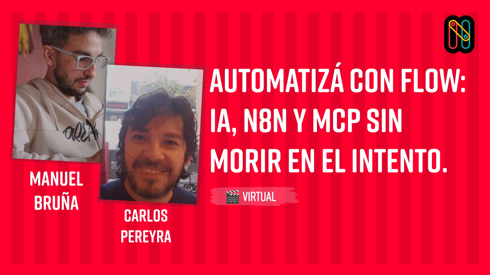

# Nerdearla Agenda - MCP Server

[](https://modelcontextprotocol.io/) [](./package.json) [](https://nodejs.org/) [](https://www.typescriptlang.org/) [](./LICENSE) [](https://nerdear.la/)

Un servidor **MCP** (Model Context Protocol) que proporciona acceso a la agenda de Nerdearla en tiempo real, siguiendo la [arquitectura MCP oficial](https://modelcontextprotocol.io/docs/learn/architecture).

## 🎪 Sobre Este Proyecto

Este MCP Server fue desarrollado como demostración práctica para la charla **"Automatizá con flow: IA, n8n y MCP sin morir en el intento"** presentada por **Manuel Bruña** y **Carlos Pereyra** en **Nerdearla 2025**.



La charla muestra cómo integrar:

-   🤖 **Inteligencia Artificial**
-   🔗 **n8n** para automatización de workflows
-   ⚡ **MCP (Model Context Protocol)** para conectar IA con sistemas externos

**¿Quieres ver la charla?** 👉 [Ver en Nerdearla](https://nerdear.la/agenda/automatiza-con-flow-ia-n8n-y-mcp-sin-morir-en-el-intento/)

> 💡 **Tip**: Este proyecto es un ejemplo real de cómo implementar un MCP Server profesional que puede integrarse con Claude, n8n y otros sistemas de IA.

## 🏗️ Arquitectura MCP

Este proyecto implementa correctamente la arquitectura MCP con:

-   **Data Layer**: Protocolo JSON-RPC 2.0 para comunicación cliente-servidor
-   **Transport Layer**: Soporte para STDIO (local) y HTTP/SSE (remoto)
-   **MCP Primitives**: Tools para ejecutar funciones específicas de la agenda

## 🚀 Funcionalidades (MCP Tools)

### Herramientas Disponibles

1. **get_upcoming_talks** - Obtiene las próximas charlas basadas en GMT-3. Incluye URLs cuando están disponibles.
2. **get_past_talks** - Obtiene charlas que ya pasaron. Incluye URLs cuando están disponibles.
3. **get_topics_by_tags** - Lista temas disponibles agrupados por tags
4. **get_next_talk** - Obtiene la próxima charla más cercana. Incluye URL cuando está disponible.
5. **get_missed_talks** - Obtiene charlas que empezaron pero podrías alcanzar. Incluye URLs cuando están disponibles.
6. **get_best_talk_recommendation** - Proporciona una recomendación experta sobre la charla más destacada del evento 🎯

### 🎪 Easter Egg

¿Buscas la mejor charla de Nerdearla? Prueba la herramienta `get_best_talk_recommendation` y descubre nuestra recomendación especial... 😉

## 📦 Instalación

```bash
pnpm install
```

## 🎯 Uso

### Transport STDIO (Claude Desktop)

```bash
# Servidor MCP para Claude Desktop
node src/index.js

# O con npm script
pnpm start
```

### Transport HTTP/SSE (Conexiones Remotas)

```bash
# Servidor MCP con HTTP transport
MCP_TRANSPORT=http node src/index.js

# Con puerto específico
MCP_TRANSPORT=http PORT=8000 node src/index.js

# O con npm script
pnpm start:http

# Con variables de entorno
MCP_TRANSPORT=http MCP_PORT=8000 pnpm start
```

## ⚙️ Configuración Claude Desktop

### Opción 1: STDIO Transport (Recomendado)

```json
{
	"mcpServers": {
		"nerdearla-agenda-mcp": {
			"command": "node",
			"args": ["/ruta/absoluta/al/proyecto/src/index.js"]
		}
	}
}
```

### Opción 2: HTTP Transport (Remoto)

```json
{
	"mcpServers": {
		"nerdearla-agenda-mcp": {
			"command": "node",
			"args": ["/ruta/absoluta/al/proyecto/src/index.js", "http", "3000"]
		}
	}
}
```

**Ubicación del archivo:**

-   **macOS**: `~/Library/Application Support/Claude/claude_desktop_config.json`
-   **Windows**: `%APPDATA%\Claude\claude_desktop_config.json`

## 🧪 Testing

### Con MCP Inspector

```bash
# Inspector MCP (STDIO transport)
DANGEROUSLY_OMIT_AUTH=true npx @modelcontextprotocol/inspector node src/index.js

# Luego abrir: http://localhost:6274
```

### Testing Manual

```bash
# Test STDIO transport
echo '{"jsonrpc": "2.0", "id": 1, "method": "tools/list"}' | node src/index.js

# Test HTTP transport - Health check
curl http://localhost:3000/health

# Test HTTP transport - Server info
curl http://localhost:3000/

# Test MCP endpoint (Streamable HTTP)
curl http://localhost:3000/mcp
```

### 🔍 MCP Inspector

Para probar con el MCP Inspector oficial:

```bash
# Opción 1: Script automático (Recomendado)
pnpm run inspector

# Opción 2: Manual
npx @modelcontextprotocol/inspector npx nerdearla-agenda

# Opción 3: Con servidor HTTP
# 1. Iniciar el servidor
pnpm start:http

# 2. En la interfaz del inspector:
#    Transport Type: Streamable HTTP
#    URL: http://localhost:3000/mcp
```

## 🏗️ Arquitectura del Proyecto

```
src/
├── index.js          # MCP Server principal con transport layers
├── agenda-service.js # Lógica de negocio (herramientas)
├── scraper.js        # Web scraping con Puppeteer
├── time-utils.js     # Utilidades de tiempo GMT-3
└── mcp-tools.js      # Definición de MCP tools
```

## 🔧 Características Técnicas

-   **MCP Compliant**: Sigue la [arquitectura oficial MCP](https://modelcontextprotocol.io/docs/learn/architecture)
-   **Múltiples Transports**: STDIO (local) y HTTP/SSE (remoto) con patrón profesional
-   **Tool Discovery**: Implementa `tools/list` para descubrimiento dinámico
-   **Tool Execution**: Implementa `tools/call` para ejecución de herramientas
-   **HTTP Features**: Health checks, CORS, autorización Bearer token opcional
-   **Session Management**: Manejo de sesiones SSE con cleanup automático
-   **Scraping Inteligente**: Puppeteer para contenido dinámico de React SPA
-   **Timezone GMT-3**: Manejo correcto de hora argentina
-   **Variables de Entorno**: Configuración flexible con `MCP_TRANSPORT`, `MCP_PORT`, etc.

## 📊 Ejemplo de Tool Execution

```json
{
	"jsonrpc": "2.0",
	"id": 1,
	"method": "tools/call",
	"params": {
		"name": "get_upcoming_talks",
		"arguments": {
			"limit": 3
		}
	}
}
```

**Respuesta:**

```json
{
	"jsonrpc": "2.0",
	"id": 1,
	"result": {
		"content": [
			{
				"type": "text",
				"text": "{\n  \"currentTime\": \"2025-09-23T15:30:00-03:00\",\n  \"upcomingTalks\": [...],\n  \"total\": 3\n}"
			}
		]
	}
}
```

## 🚀 Build y Distribución

```bash
# Crear paquete
pnpm build

# Instalar globalmente
pnpm install:global

# Usar globalmente
npx nerdearla-agenda-mcp
npx nerdearla-agenda-mcp http
```

## 🆚 Transport Layers

| Transport    | Puerto | Uso                | Conexión |
| ------------ | ------ | ------------------ | -------- |
| **STDIO**    | -      | Claude Desktop     | Local    |
| **HTTP/SSE** | 3000   | Conexiones remotas | Red      |

## 📚 Documentación MCP

-   [Arquitectura MCP](https://modelcontextprotocol.io/docs/learn/architecture)
-   [MCP Specification](https://modelcontextprotocol.io/docs)
-   [Transport Layers](https://modelcontextprotocol.io/docs/learn/architecture#transport-layer)

## 👥 Autores

| Speaker            | GitHub                                             | LinkedIn                                          |
| ------------------ | -------------------------------------------------- | ------------------------------------------------- |
| **Manuel Bruña**   | [@manubruña](https://github.com/tecnomanu)         | [LinkedIn](https://linkedin.com/in/manuelbrunia)  |
| **Carlos Pereyra** | [@carlospereyra](https://github.com/carlospereyra) | [LinkedIn](https://linkedin.com/in/pereyracarlos) |

## 🎯 Sobre la Charla

**"Automatizá con flow: IA, n8n y MCP sin morir en el intento"**

En esta charla demostramos cómo crear workflows inteligentes que conectan:

-   🤖 **Claude/IA** para procesamiento inteligente
-   🔗 **n8n** para orquestación de workflows
-   ⚡ **MCP** para integración de sistemas externos
-   🌐 **APIs REST** para conectividad universal

### 🛠️ Stack Tecnológico Demostrado

-   **MCP SDK 1.x** - Protocolo de comunicación con IA
-   **Node.js + TypeScript** - Runtime y tipado
-   **Puppeteer** - Web scraping dinámico
-   **Express** - HTTP server
-   **n8n** - Automatización visual
-   **Claude Desktop** - Cliente MCP nativo

## 🌟 ¿Te Gustó el Proyecto?

Si este MCP Server te resultó útil:

-   ⭐ **Dale una estrella** al repositorio
-   🐛 **Reporta bugs** si encuentras alguno
-   💡 **Sugiere mejoras** via Issues
-   🔄 **Comparte** con otros desarrolladores

## 📄 Licencia

MIT License - Siéntete libre de usar este código en tus propios proyectos.

---

**Desarrollado con ❤️ para la comunidad de Nerdearla 2025**
